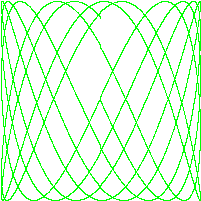
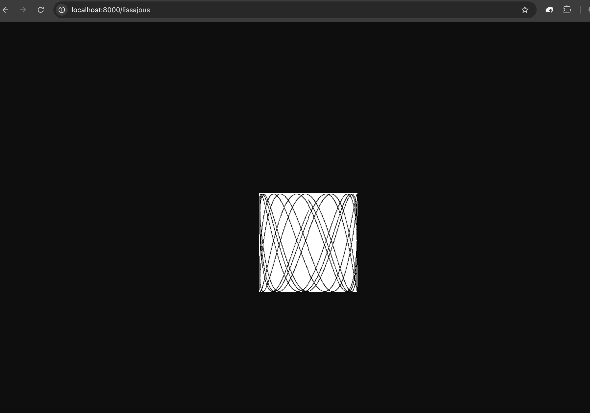

# 1.入门

## 练习题

### 1.1

```cpp
// 练习1.1: 修改 echo 程序，使其能够打印 os.Args[0]，即被执行命令本身的名字。

package main		// 声明包

import (
	"fmt"			// 导入包fmt（格式化输出）
	"os"			// 导入包os（获取命令行参数）
)

func main() {				// 主函数
	fmt.Println(os.Args)	// 打印所有参数（包括程序本身）
}
```

```shell
# 输出
# 注：符号‘#’除注释外，还代表输入的命令
# 进入到.go源文件所在目录，输入go build即可运行（无需指定源文件）
# -o 用于指定生成的可执行文件（默认以文件夹名作为文件名）

sy1_1# go build -o a.out
sy1_1# ./a.out arg1 arg2 arg3
[./a.out arg1 arg2 arg3]

```

### 1.2

```cpp
// 练习 1.2: 修改 echo 程序，使其打印每个参数的索引和值，每个一行。

package main

import (
	"fmt"
	"os"
)

func main() {
	for idx, value := range os.Args { 	// 遍历命令行参数
		fmt.Println(idx, value)			// 打印索引和参数
	}
}

```

```shell
# 编译命令同上，故省略

sy1_2# ./a.out arg1 arg2 arg3
0 ./a.out
1 arg1
2 arg2
3 arg3
```

### 1.3

```cpp
// 练习 1.3: 做实验测量潜在低效的版本和使用了 strings.Join 的版本的运行时间差异。

package main

import (
	"os"
	"fmt"
	"time" 		// 导入包time（计时器）
	"strings"	// 导入包strings（字符串）
)

func main() {
	start1 := time.Now()			// 计时器1，用于计算老方法时间开销
	str, sep := "", ""				// 初始化str存储连接后的字符串，初始化sep存储空格
	for _, arg := range os.Args {
		str += sep + arg 			// 连接参数字符串
		sep = " "					// 经过一个参数后，sep换为空格
	}
	fmt.Println(str)				// 输出连接后的值
	
	fmt.Printf("old way: %dns elapsed\n", time.Since(start1).Nanoseconds())		// 打印时间开销

	start2 := time.Now()						// 计时器2，用于计算新方法时间开销
	fmt.Println(strings.Join(os.Args, " "))		// 输出连接后的值
	fmt.Printf("new way: %dns elapsed\n", time.Since(start2).Nanoseconds())		// 打印时间开销

}
```

```shell
sy1_3# go build -o a.out
sy1_3# ./a.out arg1 arg2 arg3
./a.out arg1 arg2 arg3
old way: 113583ns elapsed
./a.out arg1 arg2 arg3
new way: 2584ns elapsed
```

### 1.4

```cpp
// 练习 1.4: 修改 dup2，出现重复的行时打印文件名称

// Dup2 prints the count and text of lines that appear more than once
// in the input.  It reads from stdin or from a list of named files.
package main

import (
    "bufio"			// 导入bufio包（标准输入）
    "fmt"
    "os"
)

// 自定义计数器
type MyCount struct {
	count int			// 记录行数
	names []string		// 记录行所在文件
}

func main() {
    counts := make(map[string]*MyCount)		// 构造<string,MyCount*>字典
    files := os.Args[1:]
    if len(files) == 0 {					// 判断是否包含文件
        countLines(os.Stdin, counts)		// 从标准输入获取行
    } else {
	
        for _, arg := range files {
            f, err := os.Open(arg)			// 打开文件
            if err != nil {
                fmt.Fprintf(os.Stderr, "dup2: %v\n", err)
                continue
            }
            countLines(f, counts)			// 从文件获取行
            f.Close()						// 关闭文件
        }
	}
	printLines(counts, len(files) != 0)		// 输出字典
}

// 构建以字符串为值、以自定义计数器为键的map
// 按行获取字符串，判断map中是否包含该字符串，是则计数+1，将文件名添加到列表中（如果不存在）
// 否则新键一个键值对插入到map中
// [in] f 文件
// [out] counts 自定义计数器map 
func countLines(f *os.File, counts map[string]*MyCount) {
    input := bufio.NewScanner(f)
    for input.Scan() {						// 按行扫描
		line := input.Text()				// 获取文本
        if _, ok := counts[line]; ok {		// 如果字典中存在该字符串
			counts[line].count++;			// 计数加1
			if !contains(counts[line].names, f.Name()) {		// 判断是否已经包含文件名
				counts[line].names = append(counts[line].names, f.Name())	// 添加文件名
			}
		} else {
			counts[line] = &MyCount{		// 插入新键-值对
				1,							// 计数为1
				make([]string, 1),			// 空的字符串数组
			}
			counts[line].names[0] = f.Name()	// 填充字符串数组
		}
    }
    // NOTE: ignoring potential errors from input.Err()
}

// 根据是否是文件输出自定义计数器map
// [in] counts	自定义计数器map
// [in] flagFile 文件标志
func printLines(counts map[string]*MyCount, flagFile bool) {
	for line, c := range counts {
		if c.count > 1 {
			if flagFile {		// 判断是否由文件读取
				fmt.Printf("%d\t%s\t%v\n", c.count, line, c.names)
			} else {
				fmt.Printf("%d\t%s\n", c.count, line)
			}
		}
	}
}

// 判断字符串数组是否包含某一个字符串(暴力法)
// [in] slice 字符串数组
// [in] s 字符串
// [out] 返回是否包含
func contains(slice []string, s string) bool {
	for _, value := range slice {
		if value == s {
			return true
		}
	}
	return false 
}

```

```shell
sy1_4# cat test1.txt 
b
b
c
sy1_4# cat test2.txt 
a
a
b
b
b
c
sy1_4# ./a.out test1.txt test2.txt 
2       c       [test1.txt test2.txt]
2       a       [test2.txt]
5       b       [test1.txt test2.txt]
```

### 1.5

```cpp
// 练习 1.5: 修改前面的Lissajous程序里的调色板，由黑色改为绿色。
// 我们可以用color.RGBA{0xRR, 0xGG, 0xBB, 0xff}来得到#RRGGBB这个色值，
// 三个十六进制的字符串分别代表红、绿、蓝像素。

// Lissajous generates GIF animations of random Lissajous figures.
package main

import (
    "image"             // 导入image包（图像处理）
    "image/color"       // 导入image下的子包color（颜色）
    "image/gif"         // 导入gif包（动图）
    "io"
    "math"              // 导入math包（数学）
    "math/rand"         // 导入rand包（随机数）
    "os"                
    "time"
)

var palette = []color.Color{color.White, color.Black, color.RGBA{0x00, 0xff, 0x00, 0xff}}  // 颜色数组

const (
    whiteIndex = 0 // first color in palette
    blackIndex = 1 // next color in palette
	greenIndex = 2 // 绿色
)

func main() {
    // The sequence of images is deterministic unless we seed
    // the pseudo-random number generator using the current time.
    // Thanks to Randall McPherson for pointing out the omission.
    rand.Seed(time.Now().UTC().UnixNano())      // 使用当前时间生成随机数
    lissajous(os.Stdout)
}

func lissajous(out io.Writer) {
    const (
        cycles  = 5     // number of complete x oscillator revolutions
        res     = 0.001 // angular resolution
        size    = 100   // image canvas covers [-size..+size]
        nframes = 64    // number of animation frames
        delay   = 8     // delay between frames in 10ms units
    )

    freq := rand.Float64() * 3.0 // relative frequency of y oscillator
    anim := gif.GIF{LoopCount: nframes}
    phase := 0.0 // phase difference
    for i := 0; i < nframes; i++ {
        rect := image.Rect(0, 0, 2*size+1, 2*size+1)
        img := image.NewPaletted(rect, palette)
        for t := 0.0; t < cycles*2*math.Pi; t += res {
            x := math.Sin(t)
            y := math.Sin(t*freq + phase)
            img.SetColorIndex(size+int(x*size+0.5), size+int(y*size+0.5),
                greenIndex)
        }
        phase += 0.1
        anim.Delay = append(anim.Delay, delay)
        anim.Image = append(anim.Image, img)
    }
    gif.EncodeAll(out, &anim) // NOTE: ignoring encoding errors
}


```

```shell
sy1_5# ./a.out >out.gif
```



### 1.6

```cpp
// 练习 1.6: 修改Lissajous程序，修改其调色板来生成更丰富的颜色，
// 然后修改SetColorIndex的第三个参数，看看显示结果吧。

// Lissajous generates GIF animations of random Lissajous figures.
package main

import (
    "image"
    "image/color"
    "image/gif"
    "io"
    "math"
    "math/rand"
    "os"
    "time"
)

var palette = []color.Color{
	color.White, 
	color.Black, 
	color.RGBA{0x11, 0x22, 0x33, 0xff}, 
	color.RGBA{0xaa, 0xbb, 0xcc, 0xff},
	color.RGBA{0x00, 0xbb, 0x00, 0xff},
	color.RGBA{0xff, 0x00, 0x00, 0xff},		// 红
	color.RGBA{0x00, 0xff, 0x00, 0xff},		// 绿
	color.RGBA{0x00, 0x00, 0xff, 0xff},		// 蓝
}

const (
    whiteIndex = 0 // first color in palette
    blackIndex = 1 // next color in palette
	color1 = 2
	color2 = 3
	color3 = 4
	redIndex = 5
	greenIndex = 6
	blueIndex = 7
	colorNum = 8

)

func main() {
    // The sequence of images is deterministic unless we seed
    // the pseudo-random number generator using the current time.
    // Thanks to Randall McPherson for pointing out the omission.
    rand.Seed(time.Now().UTC().UnixNano())
    lissajous(os.Stdout)
}

func lissajous(out io.Writer) {
    const (
        cycles  = 5     // number of complete x oscillator revolutions
        res     = 0.001 // angular resolution
        size    = 100   // image canvas covers [-size..+size]
        nframes = 64    // number of animation frames
        delay   = 8     // delay between frames in 10ms units
    )

    freq := rand.Float64() * 3.0 // relative frequency of y oscillator
    anim := gif.GIF{LoopCount: nframes}
    phase := 0.0 // phase difference
	colorIndex := uint8(whiteIndex)
    for i := 0; i < nframes; i++ {
        rect := image.Rect(0, 0, 2*size+1, 2*size+1)
        img := image.NewPaletted(rect, palette)
        for t := 0.0; t < cycles*2*math.Pi; t += res {
            x := math.Sin(t)
            y := math.Sin(t*freq + phase)
            img.SetColorIndex(size+int(x*size+0.5), size+int(y*size+0.5),
                colorIndex)
        }
		colorIndex = uint8(i % colorNum)			// 动态更新颜色
        phase += 0.1
        anim.Delay = append(anim.Delay, delay)
        anim.Image = append(anim.Image, img)
    }
    gif.EncodeAll(out, &anim) // NOTE: ignoring encoding errors
}


```

```shell
sy1_6# ./a.out > out.gif
```


### 1.7

```cpp
// 练习 1.7： 函数调用io.Copy(dst, src)会从src中读取内容，并将读到的结果
// 写入到dst中，使用这个函数替代掉例子中的ioutil.ReadAll来拷贝响应结构体到
// os.Stdout，避免申请一个缓冲区（例子中的b）来存储。记得处理io.Copy返回结
// 果中的错误。

// Fetch prints the content found at a URL.
package main

import (
    "fmt"
    "io"
    "net/http"      // 网络
    "os"
)

func main() {
    for _, url := range os.Args[1:] {
        resp, err := http.Get(url)
        if err != nil {
            fmt.Fprintf(os.Stderr, "fetch: %v\n", err)
            os.Exit(1)
        }
        // b, err := io.ReadAll(resp.Body)
		_, err = io.Copy(os.Stdout, resp.Body)  // 拷贝数据到标准输出
        if err != nil {
            fmt.Fprintf(os.Stderr, "fetch: reading %s: %v\n", url, err)
            os.Exit(1)
        }
        resp.Body.Close()
    }
}

```

```shell
sy1_7# ./a.out https://www.baidu.com
<!DOCTYPE html>
<!--STATUS OK--><html> <head><meta http-equiv=content-type content=text/html;charset=utf-8><meta http-equiv=X-UA-Compatible content=IE=Edge><meta content=always name=referrer><link 
...
sy1_7# 
```

### 1.8

```cpp
// 练习 1.8: 修改fetch这个范例，如果输入的url参数没有 http:// 前缀的话，
// 为这个url加上该前缀。你可能会用到strings.HasPrefix这个函数。

// Fetch prints the content found at a URL.
package main

import (
    "fmt"
    "io"
	"strings"
    "net/http"
    "os"
)

func main() {
    for _, url := range os.Args[1:] {
		prefix := "https://"                        // 定义http前缀
		if !strings.HasPrefix(url, prefix) {        // 判断是否存在http前缀
			fmt.Println("No prefix, add ", prefix)  
			url = prefix + url;	                    // 不是则添加上http前缀
		}
        resp, err := http.Get(url)                  // 请求访问，获取响应报文
        if err != nil {
            fmt.Fprintf(os.Stderr, "fetch: %v\n", err)
            os.Exit(1)
        }
        b, err := io.ReadAll(resp.Body)             // 读取响应报文
        resp.Body.Close()
        if err != nil {
            fmt.Fprintf(os.Stderr, "fetch: reading %s: %v\n", url, err)
            os.Exit(1)
        }
        fmt.Printf("%s", b)
    }
}

```

```shell
sy1_8# ./a.out www.baidu.com 
No prefix, add  https://
<!DOCTYPE html>
<!--STATUS OK--><html> <head><meta http-equiv=content-type content=text/html;charset=utf-8><meta http-equiv=X-UA-Compatible content=IE=Edge><meta content=always name=referrer><link rel=stylesheet type=text/css href=https://ss1.bdstatic.com/5eN1bjq8AAUYm2zgoY3K/r/www/cache/bdorz/baidu.min.css><title>百度一下，你就知道</title></head> <body link=#0000cc> <div id=wrapper> <div id=head> <div class=head_wrapper> <div class=s_form> <div class=s_form_wrapper> <div id=lg>  </div> <form id=form name=f action=//www.baidu.com/s class=fm> <input type=hidden name=bdorz_come value=1> <input type=hidden name=ie value=utf-8> <input 
...
sy1_8# 
```

### 1.9

```cpp
// 练习 1.9: 修改fetch打印出HTTP协议的状态码，可以从resp.Status变量得到该状态码。

// Fetch prints the content found at a URL.
package main

import (
    "fmt"
    "io"
    "net/http"
    "os"
)

func main() {
    for _, url := range os.Args[1:] {
        resp, err := http.Get(url)
        if err != nil {
            fmt.Fprintf(os.Stderr, "fetch: %v\n", err)
            os.Exit(1)
        }
        b, err := io.ReadAll(resp.Body)
        resp.Body.Close()
        if err != nil {
            fmt.Fprintf(os.Stderr, "fetch: reading %s: %v\n", url, err)
            os.Exit(1)
        }
        fmt.Printf("%s", b)

		status := resp.Status                   // 获取状态码
		fmt.Println("Status: ", status)         // 打印状态码
    }
}

```

```shell
sy1_9# ./a.out https://www.baidu.com
<!DOCTYPE html>
<!--STATUS OK--><html> <head><meta http-equiv=content-type content=text/html;charset=utf-8><meta http-equiv=X-UA-Compatible content=IE=Edge><meta content=always name=referrer><link 
...
Status:  200 OK
 
```

### 1.10

```cpp
// 练习 1.10： 找一个数据量比较大的网站，用本小节中的程序调研网站的缓存
// 策略，对每个URL执行两遍请求，查看两次时间是否有较大的差别，并且每次获
// 取到的响应内容是否一致，修改本节中的程序，将响应结果输出到文件，以便于
// 进行对比。

// Fetchall fetches URLs in parallel and reports their times and sizes.
package main

import (
    "fmt"
    "io"
    "net/http"
    "os"
    "time"
)

func main() {
    start := time.Now()
    ch := make(chan string) // 新键通道（用于在routine之间传输数据）
    for _, url := range os.Args[1:] {
        go fetch(url, ch) // start a goroutine
    }
    for range os.Args[1:] {
        fmt.Println(<-ch) // receive from channel ch
    }
    fmt.Printf("%.2fs elapsed\n", time.Since(start).Seconds())
}

func fetch(url string, ch chan<- string) {
    start := time.Now()
    resp, err := http.Get(url)
    if err != nil {
        ch <- fmt.Sprint(err) // send to channel ch
        return
    }
	// 创建新文件（以时间戳命名）
	fileName := fmt.Sprintf("%v.txt", start.Nanosecond())
	file, err := os.Create(fileName)    
	if err != nil {
		ch <- fmt.Sprint(err)
		return
	}
	// 将响应结果保存至文件中
    nbytes, err := io.Copy(file, resp.Body)
    resp.Body.Close() // don't leak resources
	file.Close()	// 关闭文件

    if err != nil {
        ch <- fmt.Sprintf("while reading %s: %v", url, err)
        return
    }
    secs := time.Since(start).Seconds()
    ch <- fmt.Sprintf("%.2fs  %7d  %s", secs, nbytes, url)
}

```

```shell
sy1_10# go build -o a.out
sy1_10# ./a.out https://www.baidu.com https://www.baidu.com
0.08s     2443  https://www.baidu.com
0.08s     2443  https://www.baidu.com
0.08s elapsed
sy1_10# ls
708404000.txt   708408000.txt   a.out           main.go
```

### 1.11

```cpp
// 练习 1.11： 在fetchall中尝试使用长一些的参数列表，比如使用在alexa.com的上百万网站里排名靠前的。
// 如果一个网站没有回应，程序将采取怎样的行为？（Section8.9 描述了在这种情况下的应对机制）。

// 答：没有回应程序会一直等待。
```

### 1.12

```cpp
// 练习 1.12: 修改Lissajour服务，从URL读取变量，比如你可以访问 http://localhost:8000/?cycles=20 
// 这个URL，这样访问可以将程序里的cycles默认的5修改为20。字符串转换为数字可以调用strconv.Atoi函数。你
// 可以在godoc里查看

// Server2 is a minimal "echo" and counter server.
package main

import (
    "fmt"
    "log"
    "net/http"
    "sync"          // 同步
	"io"
	"math/rand"
    "image"
    "image/color"
    "image/gif"
	"math"
)

var mu sync.Mutex
var count int

var palette = []color.Color{color.White, color.Black, color.RGBA{0x00, 0xff, 0x00, 0xff}}

const (
    whiteIndex = 0 // first color in palette
    blackIndex = 1 // next color in palette
	greenIndex = 2 // 绿色
)

func main() {
    http.HandleFunc("/", handler)
    http.HandleFunc("/count", counter)
	http.HandleFunc("/lissajous", func(w http.ResponseWriter, r *http.Request) {        // 添加lissajous访问接口
		lissajous(w)    
	})
    log.Fatal(http.ListenAndServe("localhost:8000", nil))
}

// handler echoes the Path component of the requested URL.
func handler(w http.ResponseWriter, r *http.Request) {
    mu.Lock()
    count++
    mu.Unlock()
    fmt.Fprintf(w, "URL.Path = %q\n", r.URL.Path)
}

// counter echoes the number of calls so far.
func counter(w http.ResponseWriter, r *http.Request) {
    mu.Lock()
    fmt.Fprintf(w, "Count %d\n", count)
    mu.Unlock()
}

func lissajous(out io.Writer) {
    const (
        cycles  = 5     // number of complete x oscillator revolutions
        res     = 0.001 // angular resolution
        size    = 100   // image canvas covers [-size..+size]
        nframes = 64    // number of animation frames
        delay   = 8     // delay between frames in 10ms units
    )

    freq := rand.Float64() * 3.0 // relative frequency of y oscillator
    anim := gif.GIF{LoopCount: nframes}
    phase := 0.0 // phase difference
    for i := 0; i < nframes; i++ {
        rect := image.Rect(0, 0, 2*size+1, 2*size+1)
        img := image.NewPaletted(rect, palette)
        for t := 0.0; t < cycles*2*math.Pi; t += res {
            x := math.Sin(t)
            y := math.Sin(t*freq + phase)
            img.SetColorIndex(size+int(x*size+0.5), size+int(y*size+0.5),
                blackIndex)
        }
        phase += 0.1
        anim.Delay = append(anim.Delay, delay)
        anim.Image = append(anim.Image, img)
    }
    gif.EncodeAll(out, &anim) // NOTE: ignoring encoding errors
}
```

```shell
sy1_12# go build -o a.out
sy1_12# ./a.out 
```


## 总结

* Go语言是一门现代化的语言，从其方便的工具链、简洁的语法规则可得一瞥。